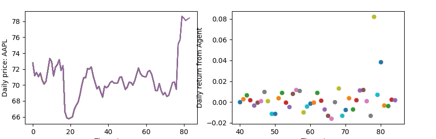

# Stock-Exchange-Pytorch


`stock-exchange-pytorch` implements some `deep learning` algorithms
to financial market data in `pytorch`.
Namely, `reinforcement learning` and  `supervised learning`
are exploited.

Reinforcement Learning
- [x] Deep Q Learning (DQN) [[1]](http://arxiv.org/abs/1312.5602), [[2]](https://www.nature.com/articles/nature14236)
- [x] Double DQN [[3]](http://arxiv.org/abs/1509.06461)
- [x] Dueling network DQN (Dueling DQN) [[4]](https://arxiv.org/abs/1511.06581)
- [x] Deep Deterministic Policy Gradient (DDPG) [[5]](http://arxiv.org/abs/1509.02971)
- [ ] Proximal Policy Optimization Algorithms (PPO) [[6]](https://arxiv.org/abs/1707.06347)

Supervised Learning
- [x] Gated Recurrent Unit (GRU) approach to fit distribution of returns in 
 a probabilistic sense [[7]](https://arxiv.org/abs/1406.1078)
- [ ] Use `uber/pyro` or `pymc` to test other approaches of probabilistic programming

Data
- [x] `market data` from [Investor's Exchange (IEX)](https://iextrading.com/).
The actual data is in `iexfinance` folder of this repository.

### Requirements
By default, it assumes you have installed `pytorch` as the name suggests. 
It also assumes you have a decent `NVIDIA GPU` with `Python 3.5+`, and `pip install gym`
if necessary.

You can run the following to train a demo `ddpg` with the 
provided data.
```buildoutcfg
python3 train_reinforce_ddpg.py
```

You can run the following to train a demo `dueling DQN` with the 
provided data.
```buildoutcfg
python3 train_reinforce.py
```

If you want to test the result, simply run
```buildoutcfg
python3 test_reinforce.py
```
If all went well, you might see something like this:



**Supervised learning** is done with `GRU` network, and can be found in 
`train_supervised.py`

### gym_stock_exchange [link](https://github.com/wbaik/gym-stock-exchange)
This is an `environment` which depends on `open-ai`'s [gym](https://github.com/openai/gym).
It supports single stock or a portfolio. For `action spaces` , both `continuous` and
`discrete` are supported.
Obviously, `DDPG` uses `continuous`, and `DQN`s uses discrete settings.
Code for [continuous](gym_exchange/envs/stock_exchange_continuous.py) and
[discrete](gym_exchange/envs/stock_exchange.py) are found here.


### Future work
- [x] Provide constraints in holdings for `gym_stock_exchange`
- [x] Provide `portfolio` by default in the `gym_stock_exchange`
- [ ] Implement `PPO` and other `policy gradient` methods
- [ ] Provide `options` and `other derivatives` valuations
- [ ] Provide more thorough support for `supervised learnings`
